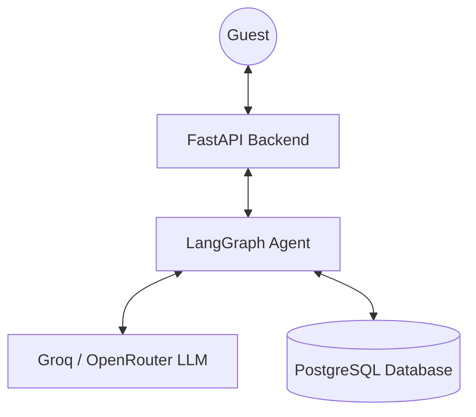

# StayEase AI Agent

## Project Structure

```
StayEase_Agent/
├── agent/
│   ├── __init__.py
│   ├── graph.py
│   ├── nodes.py
│   ├── state.py
│   └── tools.py
├── routers/
│   ├── __init__.py
│   └── chat.py
├── schemas.py
├── database.py
├── models.py
├── main.py
├── .dockerignore
├── .env.example
├── .gitignore
├── Dockerfile
├── docker-compose.yml
├── requirements.txt
├── api.md
└── README.md
```

---

## 1. Architecture Document

### 1.1 System Overview

StayEase AI Agent is a conversational booking assistant that handles three guest intents: searching for available properties, retrieving listing details, and creating bookings. A FastAPI backend receives guest messages over HTTP and delegates each message to a LangGraph agent. The agent classifies the intent, calls the appropriate database-backed tool via a ReAct loop, and returns a natural-language reply. All conversation state is persisted in PostgreSQL through LangGraph's `PostgresSaver` checkpointer, keyed by `conversation_id`.



---

### 1.2 Conversation Flow

1. **Message Received**: A guest says: "I need a room in Cox's Bazar for 2 nights for 2 guests starting tomorrow."
2. **Intent Classification**: The `classify_intent` node detects a `search` intent based on the request for a room and location.
3. **Tool Execution**: The `agent_node` triggers the `search_available_properties` tool with parameters: `location="Cox's Bazar"`, `guests=2`, and calculated dates.
4. **Database Query**: The tool queries the `listings` table for available properties in Cox's Bazar that can accommodate 2 guests.
5. **Response Generation**: The `agent_node` receives the list of properties (e.g., "Sea View Suite - 5000 BDT/night") and generates a friendly response listing the options.
6. **Result**: The guest receives: "I found 3 properties in Cox's Bazar for your dates! The 'Sea View Suite' is available for 5000 BDT per night. Would you like more details on any of these?"

---

### 1.3 LangGraph State Design

```python
class AgentState(TypedDict):
    messages:        Annotated[list[BaseMessage], add_messages]
    conversation_id: str
    intent:          Literal["search", "details", "book", "escalate"] | None
```

| Field | Type | Why it is needed |
|---|---|---|
| `messages` | `Annotated[list[BaseMessage], add_messages]` | Holds the full conversation. The `add_messages` reducer appends rather than replaces, which is required for LangGraph checkpointing and the ReAct loop to work correctly. |
| `conversation_id` | `str` | Passed as `thread_id` into the `PostgresSaver` config so state is loaded and saved per-conversation across HTTP requests. |
| `intent` | `Literal[...] \| None` | Set once by `classify_intent` and read by the conditional edge that follows. Avoids re-parsing the message list in the routing function. `None` only at graph start before classification. |

---

### 1.4 Node Design

| Node | What it does | What it updates in state | Next Node |
|---|---|---|---|
| `classify_intent` | Analyzes the latest user message to categorize the intent. | `intent` | `agent_node` or `escalate_node` |
| `agent_node` | Decides whether to call a tool or reply to the user. | `messages` | `tools` or `__end__` |
| `tool_node` | Executes the requested tool and returns the result. | `messages` | `agent_node` |
| `escalate_node` | Informs the user that a human agent is required for their request. | `messages` | `__end__` |

---

### 1.5 Tool Definitions

| Tool | Input Parameters | Output Format | When used |
|---|---|---|---|
| `search_available_properties` | `location` (str), `check_in` (str), `check_out` (str), `guests` (int) | JSON list of available listings with IDs and prices. | When guest searches for rooms. |
| `get_listing_details` | `listing_id` (int) | JSON object with full description and amenities. | When guest asks about a specific property. |
| `create_booking` | `listing_id` (int), `guest_name` (str), `check_in` (str), `check_out` (str) | JSON confirmation with a `booking_id`. | When guest confirms they want to book. |

---

### 1.6 Database Schema Design

#### `listings`
| Column | Type | Notes |
|---|---|---|
| `id` | `SERIAL` PK | |
| `name` | `VARCHAR(255)` NOT NULL | |
| `location` | `VARCHAR(100)` NOT NULL | |
| `price_per_night` | `INTEGER` NOT NULL | Amount in BDT |
| `description` | `TEXT` | |
| `max_guests` | `INTEGER` NOT NULL | |
| `available` | `BOOLEAN` DEFAULT `TRUE` | |

#### `bookings`
| Column | Type | Notes |
|---|---|---|
| `id` | `SERIAL` PK | |
| `listing_id` | `INTEGER` FK → `listings.id` | |
| `guest_name` | `VARCHAR(255)` NOT NULL | |
| `check_in` | `DATE` NOT NULL | |
| `check_out` | `DATE` NOT NULL | |
| `total_price` | `INTEGER` NOT NULL | Amount in BDT |
| `status` | `VARCHAR(50)` DEFAULT `'confirmed'` | |

#### `conversations`
| Column | Type | Notes |
|---|---|---|
| `id` | `SERIAL` PK | |
| `thread_id` | `VARCHAR(255)` UNIQUE NOT NULL | Matches `conversation_id` from the API |
| `checkpoint_data` | `BYTEA` | Serialized LangGraph state written by `PostgresSaver` |
| `updated_at` | `TIMESTAMP` DEFAULT `CURRENT_TIMESTAMP` | |


